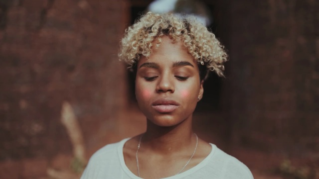

<!-- @format -->

## Augmented Reality Makeup Visualization Application

Name of Application - Zen Up

Aim of project: The aim of this project is to develop a system that can visualise makeup on users in augmented reality and can function in real time.

## Tools Used

1. Python
2. MediaPipe
3. Streamlit
4. Figma
5. Git

### How to run the application

---

- `pip install -r requirements.txt`

- `streamlit run main/zenup_makeup.py`

### Sample Output

